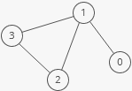

# Types of graphs

## Directed
- In directed graphs, edges point from the node at one end to the node at the other end. In undirected graphs, the edges simply connect the nodes at each end. 


## Undirected
- In undirected graphs, the edges simply connect the nodes at each end.


## Cyclic or acyclic
- A graph is cyclic if it has a cycle—an unbroken series of nodes with no repeating nodes or edges that connects back to itself. Graphs without cycles are acyclic. 


## Weighted or unweighted 
- A graph is cyclic if it has a cycle—an unbroken series of nodes with no repeating nodes or edges that connects back to itself. Graphs without cycles are acyclic. 


# Edge List

## A list of all the edges in the graph: 
```js
const graph = [[0, 1], [1, 2], [1, 3], [2, 3]];
```
- Since node 3 has edges to nodes 1 and 2, [1, 3] and [2, 3] are in the edge list. 
# Adjacency List
## A list where the index represents the node and the value at that index is a list of the node's neighbors:  
```js
const graph = [
  [1],
  [0, 2, 3],
  [1, 3],
  [1, 2],
];
```
- Since node 3 has edges to nodes 1 and 2, graph[3] has the adjacency list [1, 2].
- We could also use an object where the keys represent the node and the values are the lists of neighbors. 
```js 
const graph = {
  0: [1],
  1: [0, 2, 3],
  2: [1, 3],
  3: [1, 2],
};
```
- This would be useful if the nodes were represented by strings, objects, or otherwise didn't map cleanly to array indices. 

# Adjacency matrix 
## A matrix of 0s and 1s indicating whether node x connects to node y (0 means no, 1 means yes).   
```js
const graph = [
  [0, 1, 0, 0],
  [1, 0, 1, 1],
  [0, 1, 0, 1],
  [0, 1, 1, 0],
];
```
- Since node 3 has edges to nodes 1 and 2, graph[3][1] and graph[3][2] have value 1. 
