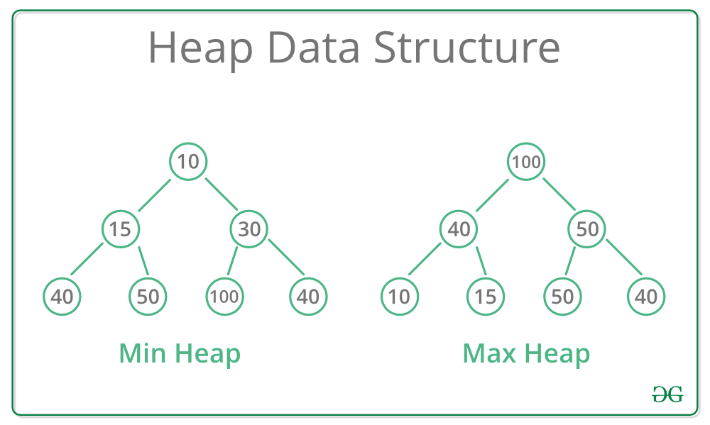

# Heap (Priority Queue)

### A Heap is a **special Tree** based data structure in which the tree is a **complete binary tree**.

## Types  
-------


```js
// Min Heap
let minHeap = [10,15,30,40,50,100,40]

// Max Heap
let maxHeap = [100,40,50,10,15,50,40]
```
### Min Heap
- The node value present at the root node must be **minimum** among the node values present at all of it’s children. 
- The same property must be recursively true for all sub-trees in that Binary Tree. 
- uses an array for storage

```js
// if starting at idx 0
// Parent
Math.floor((index - 2) / 2)

// Left
(index * 2) + 1

// Right
(index * 2) + 2
```

```js
// if starting at idx 1 and idx 0 starting at null
// Parent
Math.floor(index / 2)

// Left
index * 2

// Right
index * 2 + 1
```

### Max Heap
- The node value present at the root node must be **highest** among the node values present at all of it’s children. 
- The same property must be recursively true for all sub-trees in that Binary Tree.
- uses an array for storage

```js
// if starting at idx 0
// Parent
(index - 2) / 2

// Left
(index * 2) + 1

// Right
(index * 2) + 2
```

```js
// if starting at idx 1 and idx 0 starting at null
// Parent
(index - 2) / 2

// Left
(index * 2) + 1

// Right
(index * 2) + 2
```
