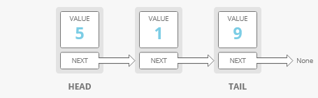
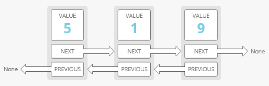

# Linked List

### A linked list organizes items sequentially, with each item storing a pointer to the next one. Use them where **insertion speed is important**, but **not** when you want to **access elements** based on their index.
--------------------------------------
## Parts of a Linked List

- `Node`: An item in a linked list
- `Head`: 1st node in a linked list
- `Tail`: The last node in a linked list

### Example

```js
    class Node:
        self.value = value
        self.next = next_node

    class LinkedList:
        self.head = head_node  
        self.tail = tail_node
```
-----------------------------------
## Types of Linked List

### Singly Linked Lists



**Strengths**:

- **Fast operations on the ends**. 
- Adding elements at either end of a linked list is O(1). 
- Removing the first element is also O(1). 

**Weaknesses**:

- **Costly lookups**. 
- To access or edit an item in a linked list, you have to take O(i) time to walk from the head of the list to the ith item. 

----------------------------------------------------------------------------------------
### Doubly Linked Lists

`In a doubly linked list, items have pointers to the next and the previous nodes.` 

